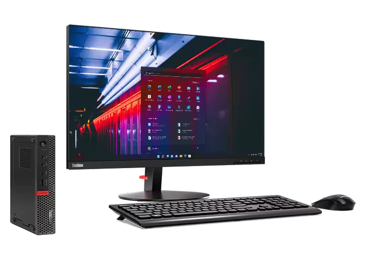

Installing macOS Hackintosh on Lenovo m920x

---
#### Hardware

| Component    |   Model                | Link                                                                                                                                     |
| ------------ | ---------------------- | ---------------------------------------------------------------------------------------------------------------------------------------- |
| CPU          | Intel Core I3 8100     | [ark.intel.com/](https://www.intel.com/content/www/us/en/products/sku/126688/intel-core-i38100-processor-6m-cache-3-60-ghz/specifications.html)
| Mainboard    | IQ3XOIL Q370           | [www.lenovo.com/](https://pcsupport.lenovo.com/pa/ru/products/desktops-and-all-in-ones/thinkcentre-m-series-desktops/thinkcentre-m920x)
| Crucial DDR4 | Samsung 8GB 2400 x2    | [samsung.com](https://semiconductor.samsung.com/dram/module/sodimm/m471a1k43cb1-crc/)   
| GPU          | Intel UND 630          | [ark.intel.com/](https://www.intel.com/content/www/us/en/products/sku/126688/intel-core-i38100-processor-6m-cache-3-60-ghz/specifications.html)
| WIFI/BT      | Intel AX200            | [ark.intel.com/](https://www.intel.com/content/www/us/en/products/sku/189347/intel-wifi-6-ax200-gig/specifications.html) 
| SSD-NVME     | kingston KC3000        | [www.kingston.com/](https://www.kingston.com/en/ssd/kc3000-nvme-m2-solid-state-drive) 

Checked on:

- macOS [Sonoma  14.4+](https://www.apple.com/newsroom/2023/09/macos-sonoma-is-available-today/)
- macOS [Sequoia 15.0+](https://www.apple.com/macos/macos-sequoia/)

Bootloader:

- Open Core 1.0.3

BIOS:
- M920X [BIOS M1UKT77A](https://pcsupport.lenovo.com/ua/uk/products/desktops-and-all-in-ones/thinkcentre-m-series-desktops/thinkcentre-m920x/downloads/ds503907)

---

#### Configuration

| Component B560M-K      |        Started         |      Kexts/SSDT        |                                                                                                          
| ---------------------- | ---------------------- | ---------------------- |
| Intel I3 8100          |         Yes            |    SSDT1.aml           |
| IGPU UHD 630           |         Yes            |    WhateverGreen.kext  |
| Intel AX200            |         Yes            |    itlwm.kext          |
| Sata Controller        |         Yes            |    Native              |
| Intel I219-LM Ethernet |         Yes            |    IntelMausi.kext     |
| Audio Realtec ALC 235  |         Yes            |    AppleALC.kext       |
| USB 3.2 (13 ports)     |         Yes            |    USBPorts.kext       |
| Sleep and Autosleep    |         No             |    Not working yet     |

Kexts and Bootloader:

- [AppleALC](https://github.com/acidanthera/AppleALC/releases) Required for sound output.
- [IntelMausi](https://github.com/acidanthera/IntelMausi/releases) Required for cable internet.
- [Lilu](https://github.com/acidanthera/Lilu/releases) Correction of some components, the library is needed for other kexts to work.
- [VirtualSMC](https://github.com/acidanthera/VirtualSMC/releases) (VirtualSMC && SMCProcessor && SMCSuperIO) Needed to emulate native Apple SMC.
- [WhateverGreen](https://github.com/acidanthera/WhateverGreen/releases) Video Fix.
- [itlwm](https://github.com/OpenIntelWireless/itlwm/releases/tag/v2.3.0) Requires Wifi to work.
- [HeliPort](https://github.com/OpenIntelWireless/HeliPort/releases/tag/v1.5.0) The app requires Wifi to work..
- [IntelBluetoothFirmware](https://github.com/OpenIntelWireless/IntelBluetoothFirmware/releases/tag/v2.4.0) Requires Bluetooth to work.
- [BlueToolFixup](https://github.com/acidanthera/BrcmPatchRAM/releases/tag/2.6.9) Requires Bluetooth to work.
- [Open Core](https://github.com/acidanthera/OpenCorePkg/releases) Operating system loader.

---

#### USB Fix

All important fixes for the correct operation of USB are already registered in USBPorts.kext, nothing else needs to be done for USB.

USB Ports

|   NAME   |        ID          |   Conector       |                                                                                                          
| ---------| ------------------ | ---------------- |
|   HS02   |        0x2         |    USB3(3)       |
|   HS04   |        0x4         |    TypeC(9)      |
|   HS05   |        0x5         |    USB3(3)       |
|   HS06   |        0x6         |    USB3(3)       |
|   HS07   |        0x7         |    USB3(3)       |
|   HS08   |        0x8         |    USB3(3)       |
|   HS14   |        0xE         |    Internal(255) |
|   SS01   |        0x11        |    USB3(3)       |
|   SS02   |        0x12        |    USB3(3)       |
|   SS03   |        0x13        |    USB3(3)       |
|   SS04   |        0x14        |    USB3(3)       |
|   SS05   |        0x15        |    USB3(3)       |
|   SS06   |        0x16        |    USB3(3)       |
